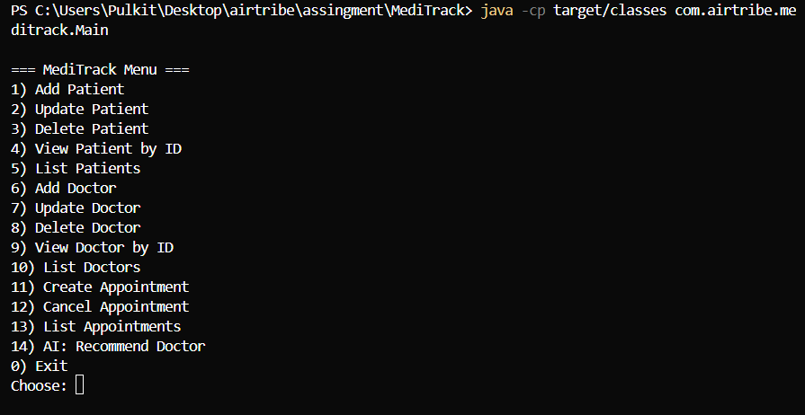
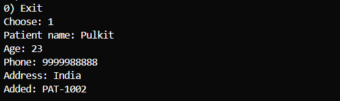
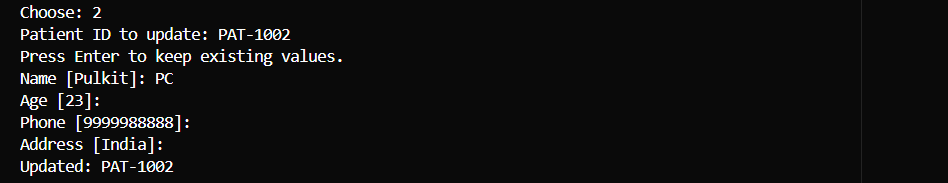
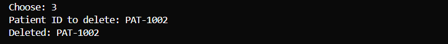
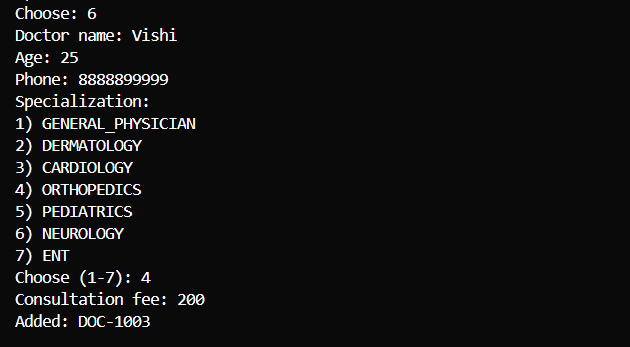
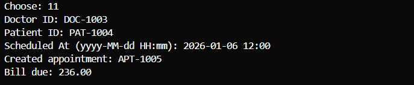
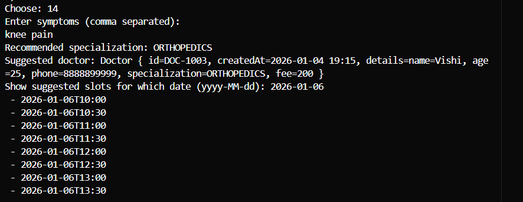

# MediTrack
Clinic & Appointment Management System

## Setup
- Install **Java JDK 25**.
  - Verify:
    ```bash
    java -version
    javac -version
    ```
- (Optional) Install **Maven 3.9+** if you want `mvn` commands.
  - Verify:
    ```bash
    mvn -version
    ```

See detailed Windows setup + screenshot checklist in `docs/Setup_Instructions.md`.

## Build & Run (Maven)
```bash
mvn -q package
mvn -q exec:java
```

## Build & Run (No Maven / javac)
```bash
# from project root (PowerShell)
New-Item -ItemType Directory -Force target/classes | Out-Null
javac --release 25 -d target/classes (Get-ChildItem -Recurse -Filter *.java -Path src/main/java | ForEach-Object { $_.FullName })
java -cp target/classes com.airtribe.meditrack.Main
```

## Run manual tests (No JUnit)
```bash
java -cp target/classes com.airtribe.meditrack.test.TestRunner
```

## Usage / Demo (what to try in the CLI)
Run the app, then use these menu actions to demo full features:

- **Patient CRUD**
  - Add Patient → View Patient by ID → Update Patient → List Patients → Delete Patient
- **Doctor CRUD**
  - Add Doctor → View Doctor by ID → Update Doctor → List Doctors → Delete Doctor
- **Appointments + Billing**
  - Create Appointment (needs an existing doctor + patient)
  - List Appointments
  - Cancel Appointment
  - Bill is displayed after appointment creation (via billing Strategy + Factory)
- **AI feature**
  - AI: Recommend Doctor → enter symptoms (e.g., `rash, itch`) → optional slots display

Tip: the app seeds a couple of doctors at startup so you can create appointments quickly.

## Sample outputs (example)
### Sample: `java -version`
```text
openjdk version "25" 2025-xx-xx
OpenJDK Runtime Environment (...)
OpenJDK 64-Bit Server VM (...)
```

### Sample: app menu
```text
=== MediTrack Menu ===
1) Add Patient
2) Update Patient
3) Delete Patient
4) View Patient by ID
5) List Patients
6) Add Doctor
7) Update Doctor
8) Delete Doctor
9) View Doctor by ID
10) List Doctors
11) Create Appointment
12) Cancel Appointment
13) List Appointments
14) AI: Recommend Doctor
0) Exit
Choose:
```

### Sample: TestRunner
```text
ALL TESTS PASSED
```

## Demo screenshots (CLI in use)

### App menu


### Patient CRUD flow

Add Patient



Update Patient



Delete Patient



### Add Doctor



### Appointment + Billing


### AI recommendation


