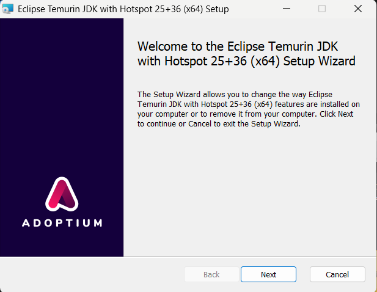

# Setup Instructions (Windows, Java 25)

## Goal
Set up **JDK 25** so that these commands work in a new terminal:

```bash
java -version
javac -version
```

Optionally, install **Maven** so that:

```bash
mvn -version
```

## Step 1 — Install JDK 25
Recommended distribution: **Eclipse Temurin 25 (LTS)**.

1. Download the Windows x64 **JDK 25** installer.
2. Install it.
3. Note the install directory (commonly one of these):
   - `C:\\Program Files\\Eclipse Adoptium\\jdk-25...`
   - `C:\\Program Files\\Java\\jdk-25...`

**Screenshot placeholder (optional)**: JDK installer



## Step 2 — Set `JAVA_HOME` and PATH
1. Open **Start** → search **“Environment Variables”** → open **“Edit the system environment variables”**.
2. Click **Environment Variables…**
3. Under **System variables**:
   - **New…**
     - Variable name: `JAVA_HOME`
     - Variable value: your JDK 25 folder (example: `C:\\Program Files\\Eclipse Adoptium\\jdk-25.0.0...`)
4. Under **System variables**, select `Path` → **Edit…** → **New**:
   - `%JAVA_HOME%\\bin`
5. Click **OK** on all dialogs.
6. Close and reopen your terminal (important).

## Step 3 — Verify Java installation
```bash
java -version
javac -version
```


## Step 4 (Optional) — Install Maven
If you want to run with Maven:
1. Install Maven 3.9+ (or install it via a package manager like Chocolatey if you use it).
2. Ensure `mvn -version` works in a new terminal.

Verify Maven:

```bash
mvn -version
```


## Step 5 — Build and run
### Option A: Using Maven
```bash
mvn -q package
mvn -q exec:java
```

### Option B: Without Maven (javac/java)
```bash
# from project root (PowerShell)
New-Item -ItemType Directory -Force target/classes | Out-Null
javac --release 25 -d target/classes (Get-ChildItem -Recurse -Filter *.java -Path src/main/java | ForEach-Object { $_.FullName })
java -cp target/classes com.airtribe.meditrack.Main
```


### Run manual tests
```bash
java -cp target/classes com.airtribe.meditrack.test.TestRunner
```
